# List of MicroSims for US Geography

Interactive Micro Simulations to help students learn US Geography fundamentals.

-   **[Agricultural Regions](./agricultural-regions/index.md)**

    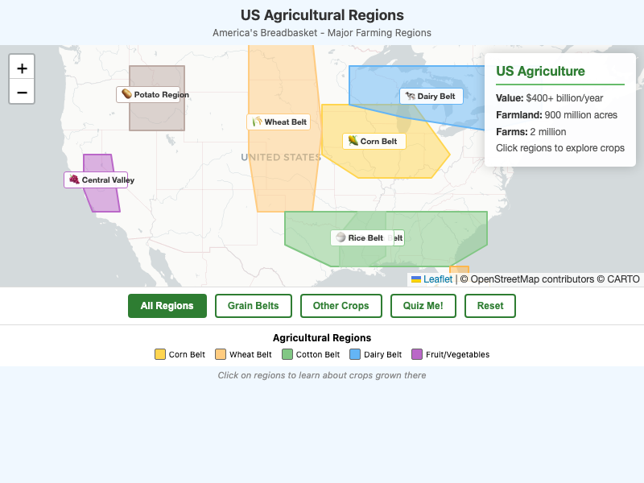

    Interactive map showing America's major farming regions including the Corn Belt, Wheat Belt, Cotton Belt, Dairy Belt, and fruit/vegetable regions.

-   **[Alaska and Hawaii](./alaska-hawaii/index.md)**

    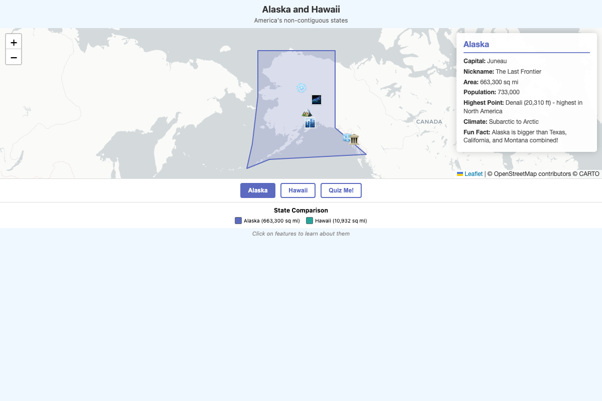

    Interactive map exploring America's two non-contiguous states with geographic features and quiz mode.

-   **[Bird's Eye View](./birds-eye-view/index.md)**

    

    Interactive comparison showing how maps represent places from above by matching 3D objects to their 2D map symbols.

-   **[Climate Zones](./climate-zones/index.md)**

    

    Interactive map showing different climate regions across America from subarctic to tropical.

-   **[Compass Rose](./compass-rose/index.md)**

    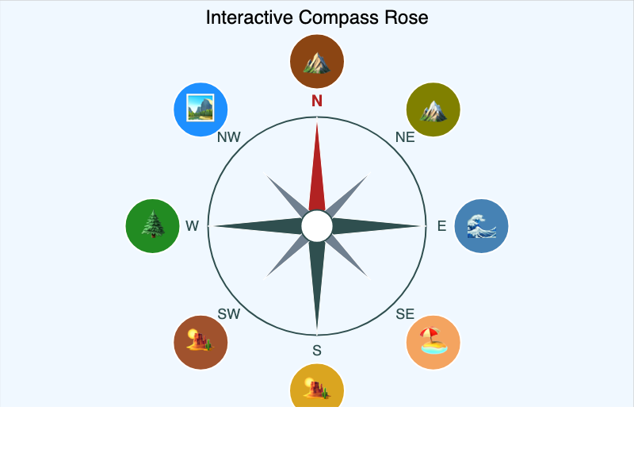

    An interactive compass rose MicroSim where students identify and apply cardinal and intermediate directions through explore and quiz modes.

-   **[Contour Lines](./contour-lines/index.md)**

    

    Interactive 3D terrain and 2D contour map visualization.

-   **[Graph Viewer](./graph-viewer/index.md)**

    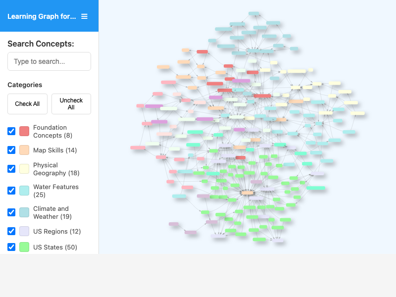

    Interactive network visualization to explore the concept dependency graph for the US Geography course.

-   **[Great Lakes](./great-lakes/index.md)**

    

    Interactive map of the five Great Lakes with facts and quiz mode.

-   **[Great Plains](./great-plains/index.md)**

    

    Interactive visualization showing an elevation cross-section from the Rocky Mountains to the Mississippi River.

-   **[Hemispheres Globe](./hemispheres-globe/index.md)**

    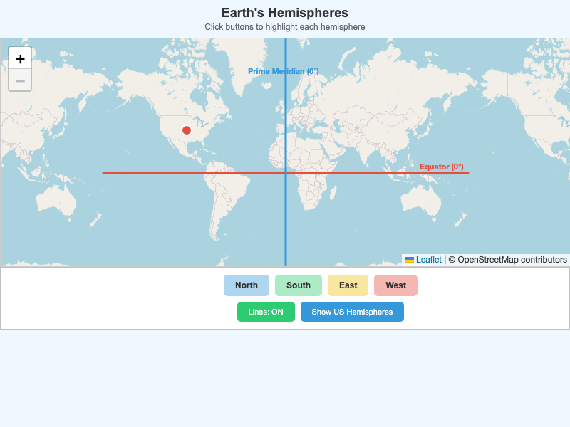

    Interactive world map showing how the Earth is divided into four hemispheres by the Equator and Prime Meridian.

-   **[Landform Comparison](./landform-comparison/index.md)**

    

    Interactive visualization comparing mountains, hills, plateaus, valleys, and plains to understand different landforms.

-   **[Landmarks](./landmarks/index.md)**

    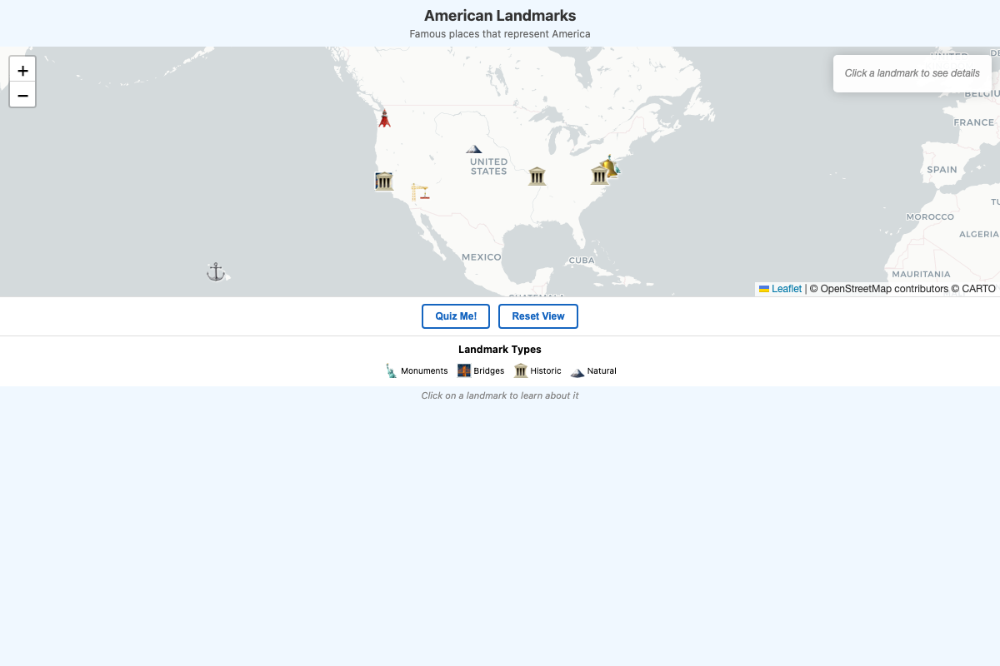

    Interactive map showing famous American landmarks including monuments, bridges, historic sites, and natural wonders.

-   **[Latitude and Longitude Grid](./lat-long-grid/index.md)**

    

    Interactive world map for learning to locate places using latitude and longitude coordinates.

-   **[Locate USA](./locate-usa/index.md)**

    

    Interactive map showing the position of the United States relative to neighboring countries and oceans.

-   **[Major Rivers](./major-rivers/index.md)**

    

    Interactive map showing the major river systems of the United States.

-   **[Map Types Compare](./map-types-compare/index.md)**

    

    Interactive comparison of political and physical map types.

-   **[Midwest States](./midwest-states/index.md)**

    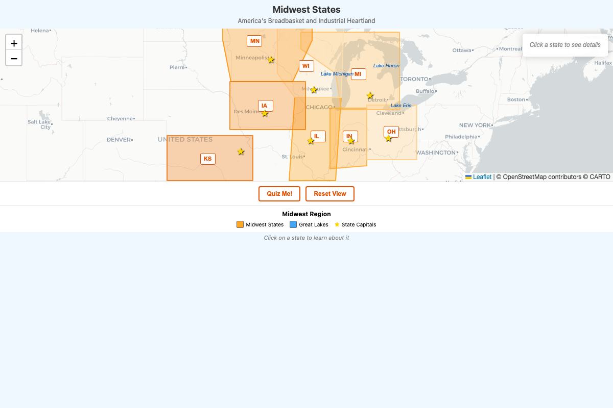

    Interactive map of the Midwest region showing states, capitals, and the Great Lakes.

-   **[Mountain States](./mountain-states/index.md)**

    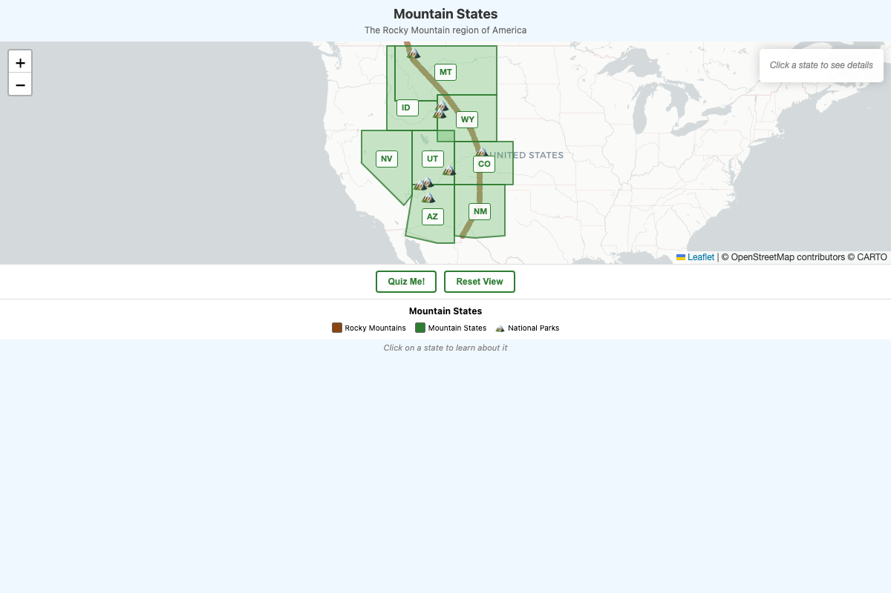

    Interactive map of the Rocky Mountain region showing states and national parks.

-   **[National Parks](./national-parks/index.md)**

    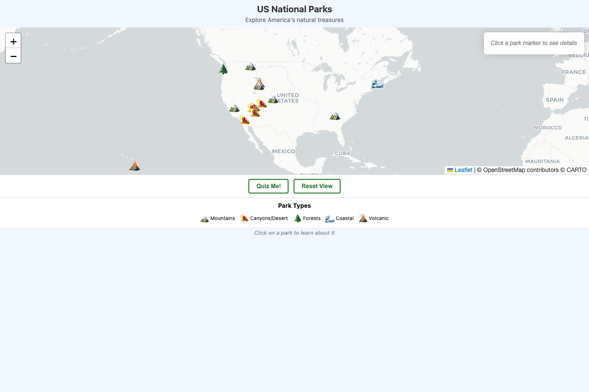

    Interactive map showing America's natural treasures including mountain, canyon, forest, coastal, and volcanic parks.

-   **[New England States](./new-england-states/index.md)**

    

    Interactive map of the six New England states showing capitals and regional features.

-   **[Northeast and Southeast Regions](./northeast-southeast/index.md)**

    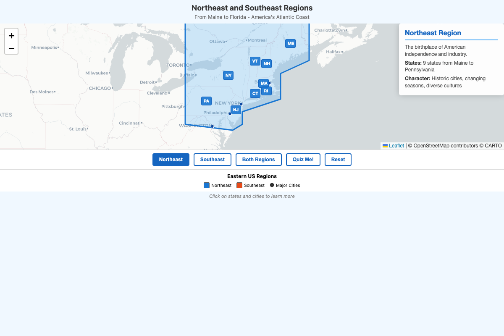

    Interactive map comparing the Northeast and Southeast US regions with major cities and state information.

-   **[Population by State](./population-by-state/index.md)**

    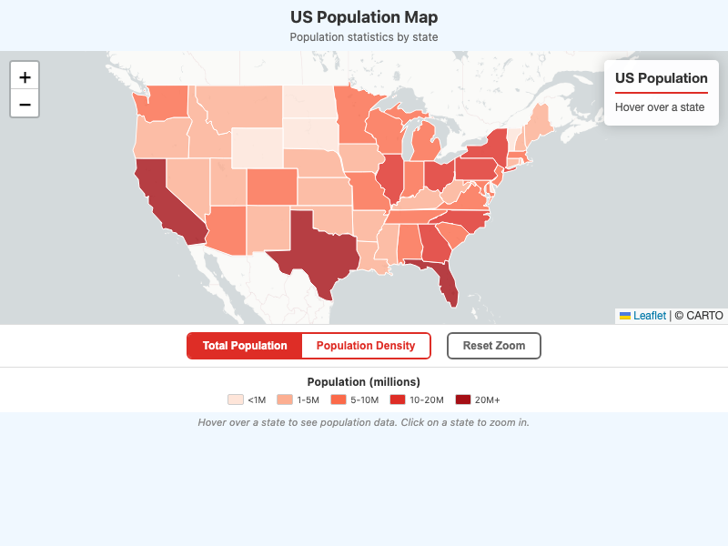

    Interactive choropleth map showing population and population density by state with toggle views.

-   **[Population Density](./population-density/index.md)**

    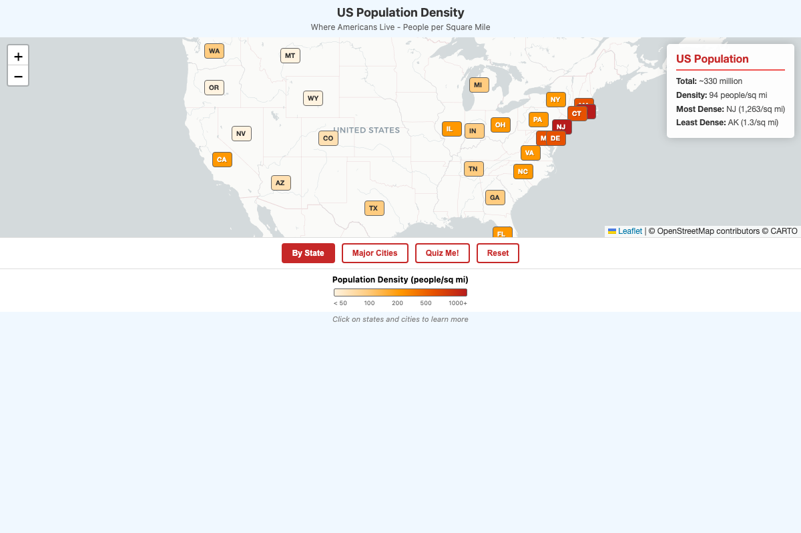

    Interactive choropleth map showing population density by state.

-   **[Precipitation Map](./precipitation-map/index.md)**

    

    Interactive choropleth map showing average annual precipitation by state.

-   **[Rocky Mountains](./rocky-mountains/index.md)**

    

    Interactive map showing the Rocky Mountain range, major peaks, and the Continental Divide.

-   **[State Capitals Quiz](./capitals/index.md)**

    

    Interactive quiz and study tool for learning all 50 US state capitals with map visualization, multiple quiz lengths, and celebration animations.

-   **[Time Zones](./time-zones/index.md)**

    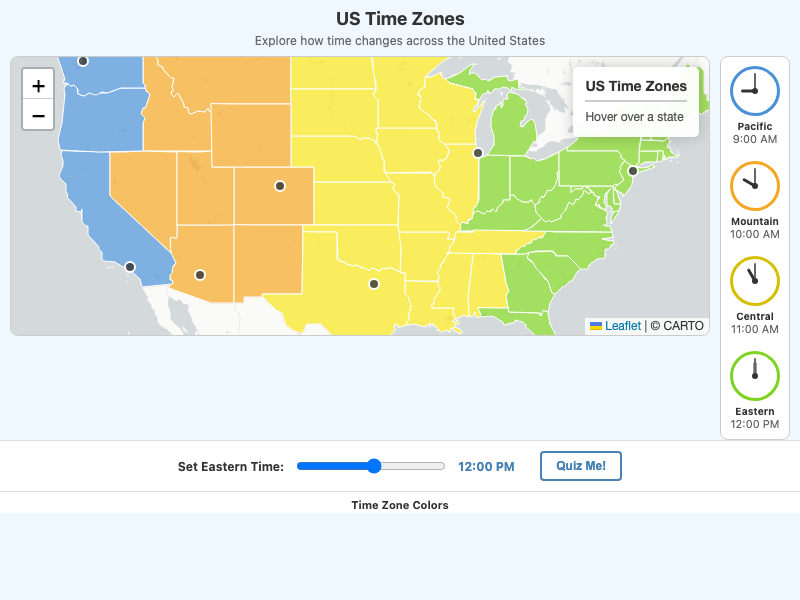

    Interactive map showing the four continental US time zones with synchronized clocks.

-   **[Tornado Alley](./tornado-alley/index.md)**

    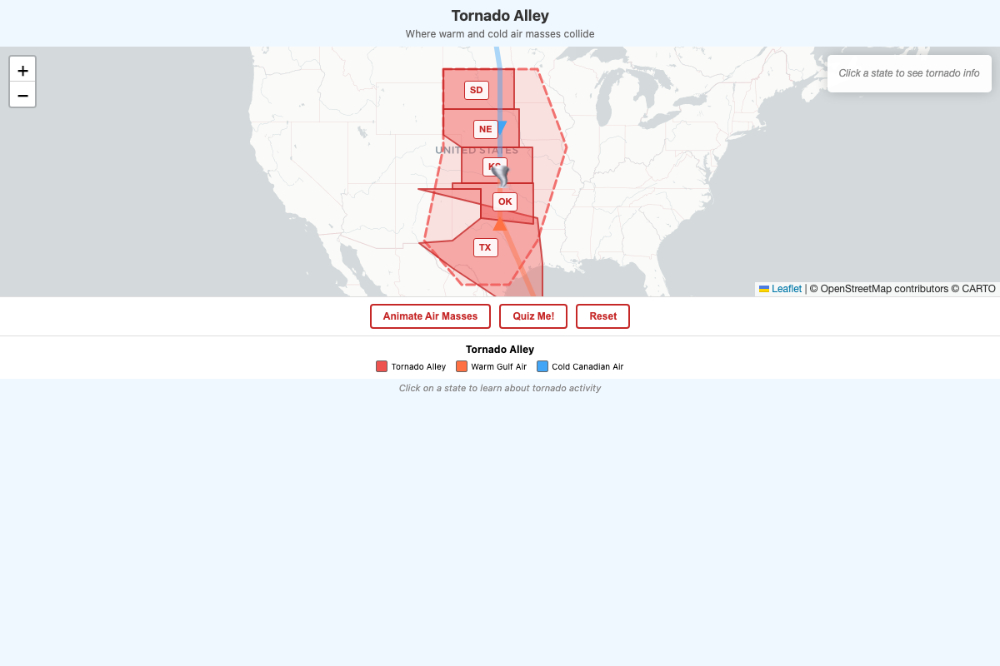

    Interactive map showing where warm Gulf air meets cold Canadian air to create America's tornado zone.

-   **[Transportation Networks](./transportation-networks/index.md)**

    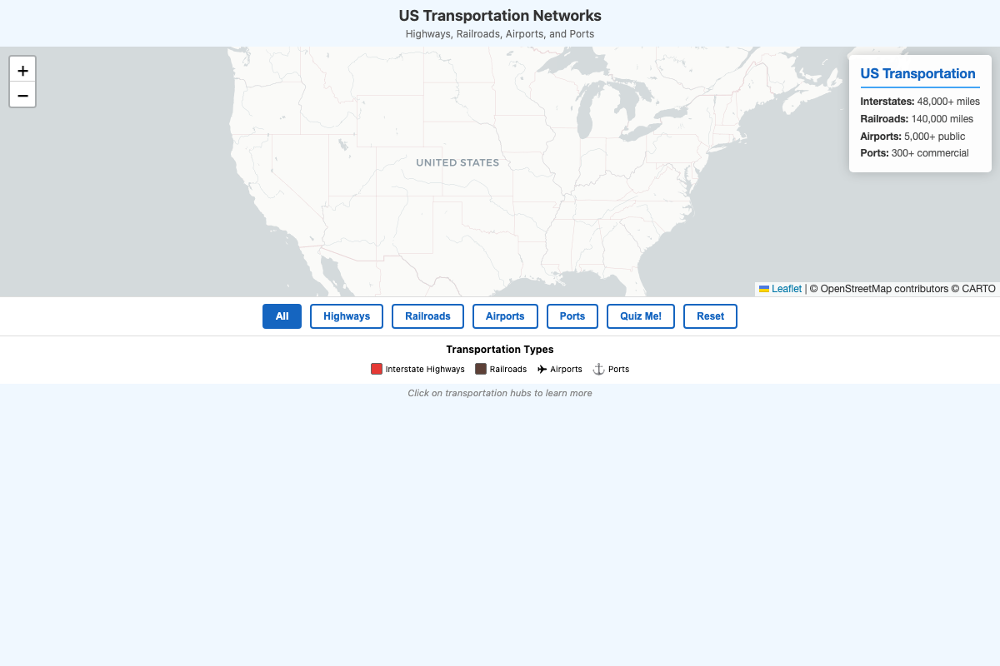

    Interactive map showing highways, railroads, airports, and ports that connect America.

-   **[US Oceans](./us-oceans/index.md)**

    

    Interactive map showing the four bodies of water that border America - Atlantic, Pacific, Gulf of Mexico, and Arctic.

-   **[US Water Features](./us-water-features/index.md)**

    

    Interactive map showing major rivers and the Great Lakes of the United States.

-   **[Weather vs Climate](./weather-climate/index.md)**

    

    Interactive comparison showing the difference between daily weather variation and long-term climate patterns.

